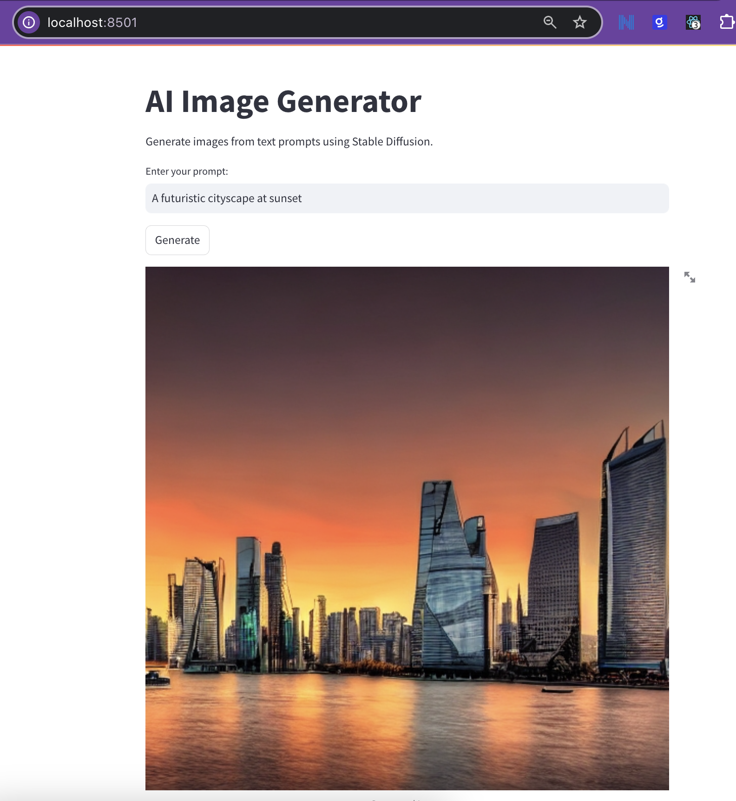

# Stable Diffusion Web Application

This project is a web application built using Streamlit and Stable Diffusion for generating images from text prompts. It uses `pyenv` for managing Python versions and virtual environments.



## Prerequisites

Before you begin, ensure you have the following installed on your macOS:

- [Homebrew](https://brew.sh/)
- [pyenv](https://github.com/pyenv/pyenv)
- [pyenv-virtualenv](https://github.com/pyenv/pyenv-virtualenv)

## Installation

Follow these steps to set up the project:

### 1. Install `pyenv` and `pyenv-virtualenv`

```bash
brew install pyenv
brew install pyenv-virtualenv
```

### 2. Configure Your Shell

Add the following lines to your shell configuration file (~/.bashrc, ~/.zshrc, etc.):

```bash
export PATH="$HOME/.pyenv/bin:$PATH"
eval "$(pyenv init --path)"
eval "$(pyenv init -)"
eval "$(pyenv virtualenv-init -)"
```

Restart your terminal or run the following command to apply the changes:

```bash
source ~/.bashrc  # for Bash users
source ~/.zshrc   # for Zsh users
```

### 3. Clone the Repository

Clone the project repository to your local machine:

```bash
git clone https://your-repo-url.git
cd your-repo-directory
```

### 4. Set Up the Python Environment

Run the following command to set up the Python environment and install dependencies:

```bash
make pyenv-setup
make install
```

### 5. Download the Stable Diffusion Model

To download the necessary model files, run:

```bash
make download-model
```

### 6. Run the Application

Start the web application using Streamlit:

```bash
make run
```

### 7. Open the Web Application

Open your browser and navigate to http://localhost:8501 to access the web application.

### 8. Clean Up

To remove the virtual environment and clean up the project, run:

```bash
make clean
```

## Usage

- Enter a text prompt in the input field.
- Click on the "Generate" button.
- View the generated image below.

## Troubleshooting

If you encounter issues with activating the pyenv environment, ensure that pyenv and pyenv-virtualenv are properly set up in your shell configuration. You may need to restart your terminal for the changes to take effect.
